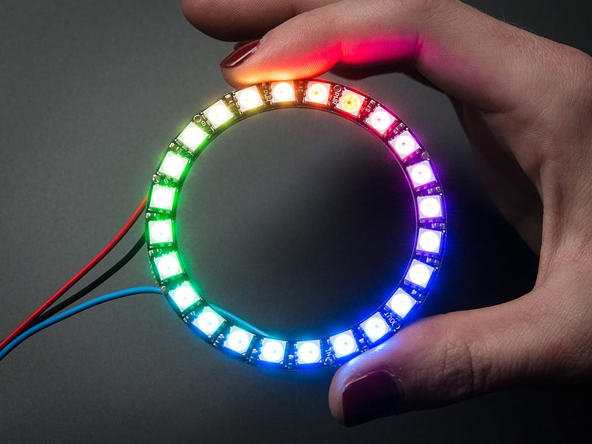

 
```
<!DOCTYPE html>
<html>
<link rel="stylesheet" type="text/css" href="estilo.css">
</html>
```

# montisc
# Montijo Perez Jose Alejandro 20212676

# Presentación del NeoPixel LED Ring WS2812

## Introducción

El NeoPixel LED Ring WS2812 es un dispositivo de iluminación LED popular y versátil que utiliza tecnología WS2812, también conocida como Neopixel, para proporcionar efectos de iluminación personalizables. En esta presentación, exploraremos sus características y aplicaciones.

---

## Características Principales

- **Tecnología WS2812:** Cada LED es controlable individualmente y puede mostrar una amplia gama de colores.
- **Tamaño y Configuración:** Disponible en varios tamaños, desde pequeños anillos hasta matrices más grandes.
- **Facilidad de Conexión:** Se conecta en cadena, lo que permite la creación de efectos de iluminación secuenciales.
- **Compatibilidad con Microcontroladores:** Funciona bien con plataformas como Arduino, Raspberry Pi y otros.

---

## Colores Personalizables

- **Control Individual:** Cada LED se puede configurar para mostrar un color específico.
- **Efectos de Animación:** Se pueden crear efectos de iluminación dinámicos, como secuencias de colores, efectos de respiración y más.
- **Brillo Ajustable:** Control total sobre la intensidad de la luz de cada LED.


---

## Aplicaciones Comunes

- **Iluminación Ambiental:** Creación de efectos de iluminación ambiental en proyectos de decoración y diseño.
- **Indicadores Visuales:** Uso como indicadores visuales en proyectos electrónicos.
- **Arte Interactivo:** Integración en instalaciones de arte interactivo.
- **Iluminación de Dispositivos:** Incorporación en trajes, cascos, gafas y más.

---

## Programación y Control

- **Librerías y Ejemplos:** Amplia variedad de librerías y ejemplos de código disponibles para diferentes plataformas.
- **Control de Color:** Los LEDs pueden controlarse mediante código para mostrar patrones y efectos específicos.
- **Interfaces de Comunicación:** Se puede controlar mediante interfaces como I2C, SPI y UART.
- 

---

## Consideraciones de Alimentación

- **Requisitos de Energía:** Los NeoPixel LED Rings requieren una fuente de alimentación adecuada, ya que el brillo y la cantidad de LEDs pueden consumir una cantidad significativa de energía.
- **Tensiones de Operación:** La mayoría funciona con voltajes de 5V, pero se deben verificar las especificaciones del modelo específico.

---

## Conclusión

El NeoPixel LED Ring WS2812 es una poderosa herramienta para la creación de efectos de iluminación personalizados y programables en una amplia variedad de proyectos. Su facilidad de uso y control individual de cada LED lo hacen ideal para proyectos de arte, decoración y electrónica.

¡Gracias por tu atención!


